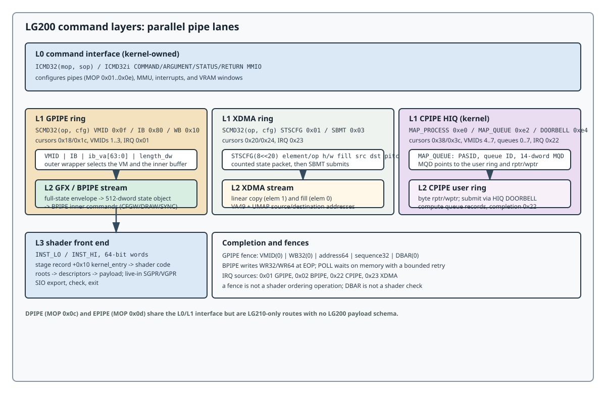

# LG200 Architecture

## The four layers

LG200 command processing is layered. Each layer has its own word format and
cursor domain; a command is meaningful only together with its layer and pipe.

| Layer | Format | Producer/consumer | Architectural role |
|------:|--------|-------------------|--------------------|
| L0 | `ICMD32(mop, sop)` / `ICMD32i` | kernel to command interface | configure a pipe, queue, MMU, interrupt, or VRAM window |
| L1 | `SCMD32(op, cfg)` | outer ring to command processor | select VM, execute an IB, write/poll memory, or manage KCD queues |
| L2 | pipe command stream | GPIPE/BPIPE/CPIPE front end | consume graphics, blit, transfer, or compute records |
| L3 | 64-bit `INST_LO/INST_HI` | shader front end | execute LG200 shader instructions from `kernel_entry` |

The same low opcode value can be reused at different layers. For example,
`0x10` is `SCMD32.WB32` at L1 and `BPIPE.WR32` at L2; their payloads and
completion rules differ. A decoder must carry the layer and pipe context along
with every command word.

## Pipe topology

The table is the LG200 software-visible topology from the kernel interface.
"Available" describes the LG200 route, not a physical block count.

| Pipe | ICMD MOP | Command-buffer pointers | LG200 owner/use | Completion source |
|------|---------:|-------------------------|----------------|------------------|
| GPIPE | `0x01` | `0x18` write, `0x1c` read | DRM graphics ring and GFX IBs | `0x01` (`CP_END_OF_GPIPE`) |
| BPIPE | `0x02` | `0x30` write, `0x34` read | graphics inner state/draw stream and blits | `0x02` (`CP_END_OF_BPIPE`) |
| CPIPE | `0x03` | `0x38` write, `0x3c` read | LG200 KCD compute queues | `0x22` (`CPIPE`) |
| XDMA | `0x04` | `0x20` write, `0x24` read | linear copy and fill | `0x23` (`XDMA`) |
| DPIPE | `0x0c` | `0x48` write, `0x4c` read | LG210 decoder route; no LG200 launch contract | LG210 `0x03` |
| EPIPE | `0x0d` | `0x50` write, `0x54` read | LG210 encoder route; no LG200 launch contract | LG210 `0x04` |

GPIPE and BPIPE are related but not interchangeable. GPIPE receives the outer
`VMID + IB` wrapper; the GFX IB contains a full-state object and an inner pipe
stream. BPIPE consumes the inner graphics commands (`CFGW`, `DRAW`, `SYNC`,
attachment state). CPIPE has a separate HIQ/user-queue ownership model; it does
not inherit GPIPE's GFX payload rules.

## Command interface and MMIO

The command interface exposes one command register, status, two argument
registers, two return registers, and per-pipe command-buffer cursors:

| MMIO offset | Register | Meaning |
|------------:|----------|---------|
| `0x00` | `COMMAND` | one `ICMD32` or `ICMD32i` command |
| `0x04` | `STATUS` | command-interface status |
| `0x08` | `ARGUMENT0` | low command argument |
| `0x0c` | `ARGUMENT1` | high command argument |
| `0x10` | `RETURN0` | low command result |
| `0x14` | `RETURN1` | high command result |
| `0x18/1c` | `GPIPE_CB_WPTR/RPTR` | GPIPE cursor pair |
| `0x20/24` | `XDMA_CB_WPTR/RPTR` | XDMA cursor pair |
| `0x30/34` | `BPIPE_CB_WPTR/RPTR` | BPIPE cursor pair |
| `0x38/3c` | `CPIPE_CB_WPTR/RPTR` | CPIPE kernel/HQ cursor pair |
| `0x40` | `FW_VERSION` | firmware version register |
| `0x44` | `IP_STATE` | command/pipe state |
| `0x48/4c` | `DPIPE_CB_WPTR/RPTR` | LG210 decoder cursor pair |
| `0x50/54` | `EPIPE_CB_WPTR/RPTR` | LG210 encoder cursor pair |
| `0x90/94` | `TIME_COUNT_LO/HI` | 64-bit time counter |

`ICMD32` is `mop[7:0] | sop[15:8]`; `ICMD32i` adds `cfg[31:16]`. The
defined MOP/SOP namespace:

| MOP | Block | SOP values |
|----:|-------|------------|
| `0x01` | GPIPE | `BGQ`, `GQSZ`, `UBGQ`, `RESET` = `1..4` |
| `0x02` | BPIPE | `BBQ`, `BQSZ`, `UBBQ` = `1..3` |
| `0x03` | CPIPE | `BCQ`, `CQSZ`, `UBCQ`, `BCDB`, `UBCDB` = `1..5` |
| `0x04` | XDMA | `BDQ`, `DQSZ`, `UBDQ` = `1..3` |
| `0x05` | SYNC | `GSYNC`, `BSYNC`, `CSYNC` = `1..3` |
| `0x06` | MMU | `MMUEN`, `UDIR`, `USAFE`, `UPG`, `UEXP`, `FTLB`, `UVMADDR`, `UVMSZ`, `RETRY` = `1..9` |
| `0x07` | ZIP | `ZEN`, `ZDIS`, `UTAGADDR`, `UTAGMASK`, `CNT`, `CNTEN`, `CNTDIS` |
| `0x08` | FREQ | `UFRQ=0`, `POWER_LEVEL_UFRQ=1` |
| `0x09` | EXC | `BEQ`, `EQSZ`, `UBEQ`, `HBEQ` = `1..4` |
| `0x0a` | DOORBELL | `ZEN`, `ZDIS` = `1..2` |
| `0x0b` | CWSR | `ZEN`, `ZDIS` = `1..2` |
| `0x0c` | DPIPE | `BBQ`, `BQSZ`, `UBBQ` = `1..3` |
| `0x0d` | EPIPE | `BBQ`, `BQSZ`, `UBBQ` = `1..3` |
| `0x0e` | VRAM | `BINDADDR`, `READ`, `WRITE` = `1..3` |

The L0 command path is kernel-owned. User command buffers use the L1/L2
formats documented in [Host Interface](host-interface.md); a user shader must
not write these MMIO registers through a mapped BAR.

## VMID and ownership

LG200 exposes eight VMID values to the pipe ownership layer. The current
LG200 topology assigns VMIDs 1--3 to DRM/GPIPE and VMIDs 4--7 to KCD/CPIPE;
VMID 0 is the kernel/control context. CPIPE has one software-visible compute
pipe with queue IDs 0--7. Its ownership state is exclusive: the LG200 kernel
route is KCD, while the DRM compute bitmap is empty. These are queue and VM
admission contracts, not evidence for physical queue hardware beyond the
exposed interface.

The KCD MQD and user-ring cursor units differ from the kernel command-buffer
cursor units: an MQD `length` is in dwords, while the LG200 KCD user ring
publishes byte `rptr/wptr` values. The distinction is normative for queue
construction and is expanded in the host chapter.

## Interrupt and exception routing

LG200 interrupt source IDs distinguish pipe completion:

| Source | Meaning | Owner selected by |
|-------:|---------|-------------------|
| `0x01` | GPIPE end-of-pipe | DRM/GFX fence handler |
| `0x02` | BPIPE end-of-pipe | BPIPE fence handler |
| `0x22` | CPIPE event | KCD owner, PASID, and VMID |
| `0x23` | XDMA event | XDMA fence handler |

The ICMD `EXC` block configures an exception queue. KCD debug traps add a
separate process-debug interface with masks for floating-point, integer,
address-watch, memory-violation, wave-start, and wave-end events. A trap event
is not a completion event: it carries process/queue attribution and requires
the debug/trap interface to be enabled before exception information is
observable. The shader `trap` instruction is an L3 operation with its own
instruction-level semantics.
