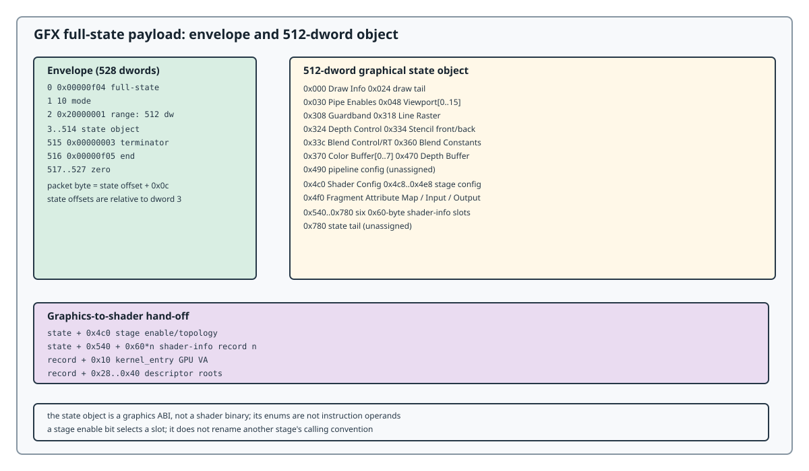

# Graphics State

This chapter defines the fixed-function and stage-selection state consumed by
the LG200 graphics path. It sits between [Host Interface](host-interface.md)
and [Shader ABI](shader-abi.md): the host chapter tells the command
processor how to reach the payload; this chapter tells the graphics front end
what the payload means; the shader chapter expands the stage records selected
here.

```text
GPIPE SCMD32(VMID + IB)
          |
          v
GFX IB full-state envelope
          |
          +-- 512-dword graphical state object
          |     +-- draw/raster/viewport/depth/blend/attachments
          |     +-- stage topology and stage I/O configuration
          |     +-- six shader-info slots
          |
          v
vertex/tessellation/geometry stages -> raster/interpolation -> fragment stage
          |
          v
blend/depth/stencil/output attachments -> completion
```



The state object is a graphics ABI, not a shader binary. Its address fields
are GPU VAs; its format and enum fields are not instruction operands.

## Chapter contents

| Page | Contract |
|------|----------|
| [Full-State Envelope](graphics/full-state.md) | the 528-dword packet form and the 512-dword state map |
| [Draw and Raster](graphics/draw-raster.md) | Draw Info, primitive enums, Pipe Enables, viewport/guardband |
| [Depth, Stencil and Blend](graphics/depth-blend.md) | depth, stencil, blend, and color/depth surface records |
| [Stage Configuration](graphics/stage-config.md) | stage topology, per-stage config words, fragment state, and the graphics-to-shader hand-off |
