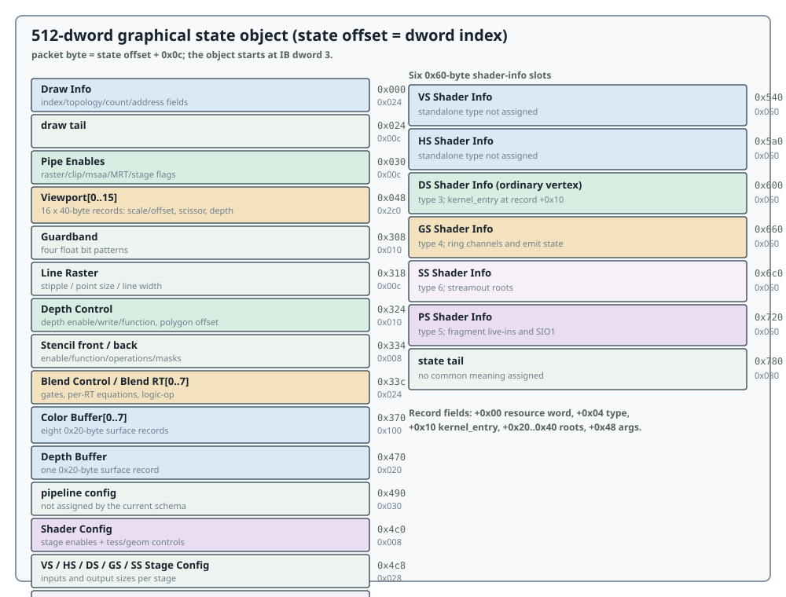

# Full-State Envelope

## The envelope

The reviewed single-draw envelope is 528 dwords (2112 bytes):

| IB dword | Value | Meaning |
|---------:|-------|---------|
| `0` | `0x00000f04` | full-state command |
| `1` | `10` | mode/config for this envelope |
| `2` | `0x20000001` | range record for 512 state dwords |
| `3..514` | state | 512-dword graphical payload |
| `515` | `0x00000003` | state terminator |
| `516` | `0x00000f05` | end command |
| `517..527` | zero | alignment in this form |

State offsets in this manual are relative to dword 3, the first dword of the
512-dword object. Packet byte offsets therefore add `0x0c`:

```text
packet_byte = state_offset + 0x0c
```

The full-state range form above is the stable base contract. Range-delta and
resource-command variants exist in producer captures but are not assigned a
general public grammar here.



## State map

| State offset | Size | Object | Contract |
|-------------:|-----:|--------|----------|
| `0x000` | `0x024` | [Draw Info](draw-raster.md#draw-info) | index/topology/count/address fields |
| `0x024` | `0x00c` | [draw tail](draw-raster.md#draw-info) | no common meaning assigned |
| `0x030` | `0x00c` | [Pipe Enables](draw-raster.md#pipe-enables) | raster, clipping, multisample, MRT, and stage flags |
| `0x03c` | `0x00c` | [pipe tail](draw-raster.md#pipe-enables) | no common meaning assigned |
| `0x048` | `0x2c0` | [Viewport\[0..15\]](draw-raster.md#viewport-and-guardband) | scale/offset, scissor, depth range |
| `0x308` | `0x010` | [Guardband](draw-raster.md#viewport-and-guardband) | four float bit patterns |
| `0x318` | `0x00c` | [Line Raster](draw-raster.md#line-raster) | stipple, point size, line width |
| `0x324` | `0x010` | [Depth Control](depth-blend.md#depth-control) | depth enable/write/function and polygon offset |
| `0x334` | `0x004` | [Stencil front](depth-blend.md#stencil) | enable/function/operations/masks |
| `0x338` | `0x004` | [Stencil back](depth-blend.md#stencil) | same shape for back face |
| `0x33c` | `0x004` | [Blend Control](depth-blend.md#blend) | independent, dual-source, logic-op gates |
| `0x340` | `0x020` | [Blend RT\[0..7\]](depth-blend.md#blend) | one 32-bit word per render target |
| `0x360` | `0x010` | [Blend Constants](depth-blend.md#blend) | four 32-bit float bit patterns |
| `0x370` | `0x100` | [Color Buffer\[0..7\]](depth-blend.md#color-and-depth-surfaces) | eight 0x20-byte surface records |
| `0x470` | `0x020` | [Depth Buffer](depth-blend.md#color-and-depth-surfaces) | one 0x20-byte surface record |
| `0x490` | `0x030` | pipeline config | not assigned by the current schema |
| `0x4c0` | `0x008` | [Shader Config](stage-config.md#shader-config) | stage enables and tessellation/geometry controls |
| `0x4c8` | `0x008` | [VS Stage Config](stage-config.md#stage-config-records) | VS inputs and output sizes |
| `0x4d0` | `0x008` | [HS Stage Config](stage-config.md#stage-config-records) | HS inputs and output sizes |
| `0x4d8` | `0x008` | [DS Stage Config](stage-config.md#stage-config-records) | DS inputs and output sizes |
| `0x4e0` | `0x008` | [GS Stage Config](stage-config.md#stage-config-records) | GS topology, stream, and output sizes |
| `0x4e8` | `0x008` | [SS Stage Config](stage-config.md#stage-config-records) | slot exists; field meanings not closed |
| `0x4f0` | `0x040` | [Fragment Attribute Map\[32\]](stage-config.md#fragment-state) | attribute ID/generated/sprite flags |
| `0x530` | `0x008` | [Fragment Input Config](stage-config.md#fragment-state) | input address/enable and system outputs |
| `0x538` | `0x004` | [Fragment Output Config](stage-config.md#fragment-state) | MRT format word |
| `0x53c` | `0x004` | fragment tail | no common meaning assigned |
| `0x540` | `0x060` | [VS Shader Info](../shader/shader-info.md) | stage slot 0 |
| `0x5a0` | `0x060` | [HS Shader Info](../shader/shader-info.md) | stage slot 1 |
| `0x600` | `0x060` | [DS Shader Info](../shader/shader-info.md) | stage slot 2; ordinary vertex role |
| `0x660` | `0x060` | [GS Shader Info](../shader/shader-info.md) | stage slot 3 |
| `0x6c0` | `0x060` | [SS Shader Info](../shader/shader-info.md) | stage slot 4 |
| `0x720` | `0x060` | [PS Shader Info](../shader/shader-info.md) | stage slot 5 |
| `0x780` | `0x080` | state tail | no common meaning assigned |

The slot and record distinction is important: a stage slot begins at the state
offset above, while its serialized packet byte location is that offset plus
`0x0c`. [Shader-Info Records](../shader/shader-info.md) use logical record
offsets within each `0x60`-byte slot.
