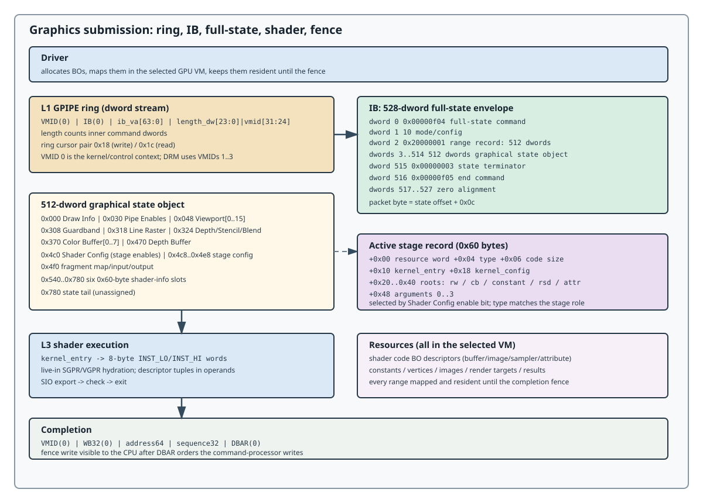

# Host Interface

This chapter defines the LG200 host command interfaces used to reach a
graphics, transfer, blit, or compute pipe. The GPU-facing contracts below use
GPU virtual addresses, dword streams, queue records, and typed payloads; host
API handles and ioctls are the driver's business, not packet fields.

An ordinary graphics call crosses these layers:

```text
API / driver state
      |
      v
BOs + GPU VM + residency
      |
      v
GPIPE outer ring: SCMD32(VMID) + SCMD32(IB)
      |
      v
IB: 528-dword full-state envelope (header + 512-dword state object)
      |
      v
BPIPE inner commands + stage records + shader code
      |
      v
raster, shader stages, output merger, completion event
```

The compute path is separate:

```text
KCD control -> HIQ SCMD32 MAP_PROCESS/MAP_QUEUE
            -> MQD-selected CPIPE user ring
            -> HIQ SCMD32 DOORBELL
            -> CPIPE command grammar and completion source 0x22
```

The XDMA path uses `STSCFG`/`SBMT` at the same L1 layer on its own ring.
Every pipe has its own command vocabulary; see the per-pipe pages below.



## Chapter contents

| Page | Contract |
|------|----------|
| [Command Words](host/scmd32.md) | the shared L1 `SCMD32` word and its common payloads |
| [Rings and Indirect Buffers](host/rings-and-ib.md) | rings, IBs, the VMID+IB wrapper, and the 528-dword envelope |
| [GPIPE](host/gpipe.md) | the graphics ring: wrapper, fence, completion |
| [BPIPE](host/bpipe.md) | the inner graphics command stream and drawcall object |
| [XDMA](host/xdma.md) | the transfer pipe: `STSCFG`/`SBMT` copy and fill |
| [CPIPE](host/cpipe.md) | KCD compute queues: HIQ, MQD, user ring, doorbell |
| [Synchronization and Traps](host/sync-fence.md) | fences, polls, barriers, and the trap boundary |
