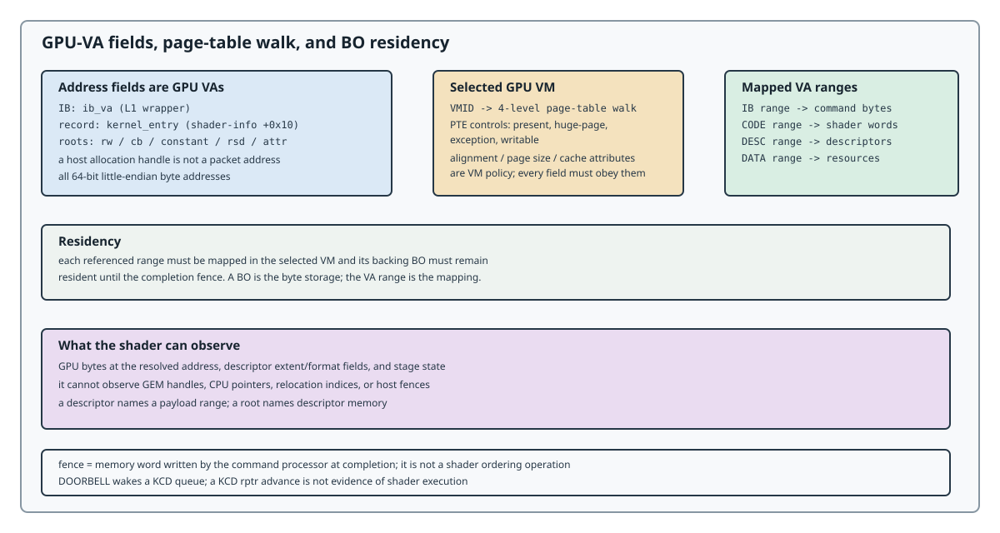

# Rings and Indirect Buffers

## Rings

A ring is a circular buffer of command dwords in GPU memory. The producer
writes commands and advances the write cursor; the command processor reads up
to the read cursor. Each pipe has a cursor pair (MMIO; see
[Architecture](../architecture.md)):

| Pipe | Write | Read | Unit |
|------|------:|-----:|------|
| GPIPE | `0x18` | `0x1c` | dwords |
| XDMA | `0x20` | `0x24` | dwords |
| BPIPE | `0x30` | `0x34` | dwords |
| CPIPE HIQ | `0x38` | `0x3c` | dwords |

MMIO is kernel-owned. A userspace KCD queue has a separate pointer domain
(byte `rptr/wptr` in its MQD; see [CPIPE](cpipe.md)).

## Indirect buffers

An indirect buffer (IB) is a nested command stream: the outer ring contains a
small wrapper that points to the inner stream instead of inlining it. The
wrapper selects the VM and gives the inner buffer's address and length:

```text
dword 0  SCMD32(VMID, vmid)
dword 1  SCMD32(IB, 0)
dword 2  ib_gpu_va[31:0]
dword 3  ib_gpu_va[63:32]
dword 4  length_dw[23:0] | vmid[31:24]
```

`length_dw` counts inner command dwords. A two-level IB may contain another
wrapper, but its range must not overlap bytes that a producer later overwrites.
The inner stream for graphics is the [full-state envelope](#the-528-dword-envelope);
for BPIPE it is the inner command stream described in [BPIPE](bpipe.md).

## The 528-dword envelope

For a single draw, the inner IB is the full-state envelope: a three-dword
header, a 512-dword graphical state object, a terminator, an end command, and
zero padding:

```text
dword 0       0x00000f04                 full-state command
dword 1       10                         mode/config
dword 2       0x20000001                 512-dword range record
dword 3..514  512 dwords                 graphical state object
dword 515     0x00000003                 state terminator
dword 516     0x00000f05                 end command
dword 517..527 zero                      alignment in this form
```

The state object is the graphics ABI payload: draw and raster state, depth and
blend, attachments, stage configuration, and six shader-info slots. State
offsets in this manual are relative to dword 3; packet byte offsets therefore
add `0x0c`:

```text
packet_byte = state_offset + 0x0c
```

The full-state range form above is the stable base contract. Range-delta and
resource-command variants exist in producer captures but are not assigned a
general public grammar.

## GPU address and residency

All address fields are little-endian GPU virtual addresses. A host allocation
handle is not a packet address. Before a packet is consumed, each referenced
range must be mapped in the selected VM and its backing BO must remain resident
through completion.

| GPU range | First consumer | Contents |
|-----------|----------------|----------|
| outer IB | GPIPE `IB` | inner command dwords |
| full-state | GFX/BPIPE state command | 512-dword graphical state object |
| shader code | shader-info `Kernel Entry` | 8-byte shader words |
| descriptors | shader-info roots | buffer/image/sampler/attribute records |
| resources | descriptor bases and attachments | constants, vertices, images, render targets, results |

LG200 page-table entries are 64 bits and use a four-level walk. Low entry
controls include present, huge-page, exception, and writable. Page alignment,
page size, and cache attributes are VM policy and must be obeyed by every
address field.


