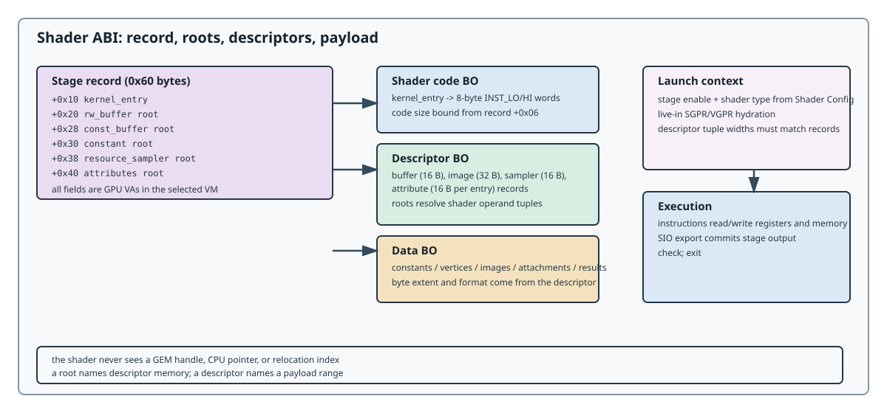

# Shader ABI

This chapter is the shader half of the LG200 graphics ABI. It starts from the
fixed offsets defined by [Graphics State](graphics-state.md), then defines
the stage record, descriptor roots, launch registers, stage inputs, and SIO
completion. The command layer that places the GFX payload in GPU memory is
defined in [Host Interface](host-interface.md).

## From GFX payload to shader launch

The graphical payload is one 512-dword state object. The shader launcher does
not search for shader metadata elsewhere; it reads the stage-enable word and
the six fixed slots below from that object:

```text
GFX IB
  -> full-state header (12 bytes)
  -> 512-dword state object
       +0x4c0  Shader Config and stage topology
       +0x540  VS Shader Info (0x60 bytes)
       +0x5a0  HS Shader Info (0x60 bytes)
       +0x600  DS Shader Info (0x60 bytes)
       +0x660  GS Shader Info (0x60 bytes)
       +0x6c0  SS Shader Info (0x60 bytes)
       +0x720  PS Shader Info (0x60 bytes)
  -> stage record roots and Kernel Entry VAs
  -> stage live-ins (SGPR/VGPR) and SIO state
  -> shader instructions
```

The offsets in this diagram are relative to the state object. Serialized packet
byte offsets add `0x0c`; for example, the DS record begins at packet byte
`0x60c`, and its `Kernel Entry` field is at packet byte `0x61c`.



## Stage slots

The six `0x60`-byte shader-info slots are fixed positions inside the 512-dword
state object. Each slot is selected by its enable bit in
[Shader Config](graphics/stage-config.md#shader-config); the selected
record is hydrated into a stage. The per-stage live-in and exit contracts are
in [Stage Conventions](shader/stages.md).

| Slot | State offset | Shader type | Role | Convention |
|------|------------:|------------:|------|------------|
| VS | `0x540` | unassigned | standalone vertex role | [Stage Conventions](shader/stages.md#vs-and-hs) |
| HS | `0x5a0` | unassigned | hull/tessellation control | [Stage Conventions](shader/stages.md#vs-and-hs) |
| DS | `0x600` | `3` | tessellation evaluation / ordinary vertex | [Stage Conventions](shader/stages.md#ds-as-ordinary-vertex) |
| GS | `0x660` | `4` | geometry | [Stage Conventions](shader/stages.md#gs-geometry) |
| SS | `0x6c0` | `6` | streamout | [Stage Conventions](shader/stages.md#ss-streamout) |
| PS | `0x720` | `5` | fragment | [Stage Conventions](shader/stages.md#ps-fragment) |

Slot enable bits select records; they do not rename one stage's calling
convention into another.

## Chapter contents

| Page | Contract |
|------|----------|
| [Shader-Info Records](shader/shader-info.md) | the `0x60`-byte stage record, field by field |
| [Descriptors](shader/descriptors.md) | buffer, image, sampler, and attribute descriptor formats |
| [Stage Conventions](shader/stages.md) | per-stage live-ins, entry shapes, and worked examples |
| [SIO](shader/sio.md) | shader input/output semantics and stream completion |
