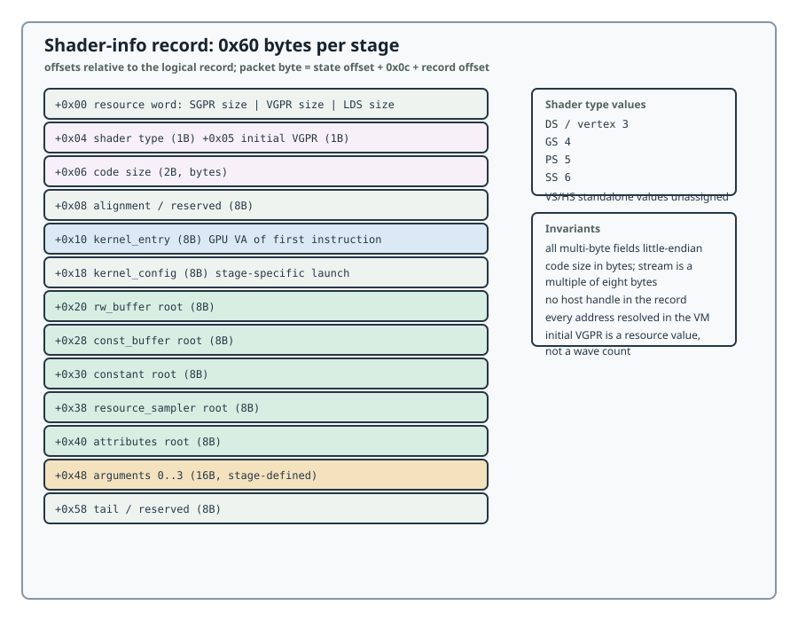

# Shader-Info Records

## Slot identity

The logical full-state payload has six `0x60`-byte stage slots:

| Role | Slot offset | Assigned shader type | Convention |
|------|------------:|---------------------:|------------|
| VS | `0x540` | standalone VS value is not assigned by this revision | [Stage Conventions](stages.md#vs-and-hs) |
| HS | `0x5a0` | standalone HS value is not assigned by this revision | [Stage Conventions](stages.md#vs-and-hs) |
| DS / ordinary vertex | `0x600` | `3` | [Stage Conventions](stages.md#ds-as-ordinary-vertex) |
| GS / geometry | `0x660` | `4` | [Stage Conventions](stages.md#gs-geometry) |
| SS / streamout | `0x6c0` | `6` | [Stage Conventions](stages.md#ss-streamout) |
| PS / fragment | `0x720` | `5` | [Stage Conventions](stages.md#ps-fragment) |

Values 0, 1, and 2 are not generic stage aliases. Standalone VS and HS type
values/live-in maps are not assigned by this revision; DS-as-VS is the reviewed
ordinary vertex convention. The field offsets below are relative to a logical
record and do not include the packet framing header.



## Record fields

| Record offset | Size | Field | LG200 contract |
|--------------:|-----:|-------|----------------|
| `+0x00` | 4 | Resource word | `SGPR Size[7:0]`, `VGPR Size[15:8]`, `LDS Size[31:16]` |
| `+0x04` | 1 | Shader type | Stage role value from the table above |
| `+0x05` | 1 | Initial VGPR/high-water value | Launch resource value; not a wave count |
| `+0x06` | 2 | Code size | Byte count of the shader image, up to `0xffff` |
| `+0x08` | 8 | Alignment/reserved | No common pointer interpretation |
| `+0x10` | 8 | `kernel_entry` | GPU VA of the first shader instruction |
| `+0x18` | 8 | `kernel_config` | Stage launch/configuration address; detailed use is stage-specific |
| `+0x20` | 8 | `rw_buffer` | Storage or streamout root |
| `+0x28` | 8 | `const_buffer` | Root of constant-buffer descriptors |
| `+0x30` | 8 | `constant` | Constant/push data root associated with the descriptor |
| `+0x38` | 8 | `resource_sampler_descriptors` | Image/sampler descriptor root |
| `+0x40` | 8 | `attributes` | Attribute descriptor-table root |
| `+0x48` | 16 | Arguments 0..3 | Four stage-defined 32-bit arguments |
| `+0x58` | 8 | Tail/reserved | low dword is used by selected streamout forms; remaining bits are reserved |

All multi-byte fields are little-endian. Code size counts bytes and a complete
instruction stream is a multiple of eight bytes. The record does not contain a
host handle; every address field is resolved in the VM selected by the outer
submission.

The schema's first word contains SGPR size, VGPR size, and LDS-size bits. The
`+0x05` initial VGPR field is a launch resource value, not a wave count. LDS
capacity and physical register limits are not implied by this record.

## Address chain and launch hydration

```text
record.kernel_entry --------------------------> shader code BO
record.const_buffer / constant ---------------> buffer descriptor/data BO
record.resource_sampler_descriptors ----------> image/sampler descriptor BO
record.attributes ----------------------------> attribute descriptor BO
record.rw_buffer -----------------------------> storage/streamout descriptor BO
                                                     |
                                                     v
                                      stage live-in SGPR/VGPR state
                                                     |
                                                     v
                                          ISA instructions and SIO records
```

The shader never sees a GEM handle, CPU pointer, or relocation index. A root
normally names descriptor memory; a descriptor names a payload range. The
command chapter requires every range to be mapped and resident before the IB
is submitted and until its completion event.

## ABI invariants

1. `kernel_entry` points to shader bytes, never to a descriptor or a host BO
   handle.
2. A root points to descriptor memory; a descriptor points to a payload or
   attachment.
3. The descriptor tuple width in the instruction must match the descriptor
   record size in the stage contract.
4. A stage record, its shader code, its descriptors, and all payload BOs must
   be mapped in the same GPU VM and remain resident until the submission fence.
5. Stage enable bits, record type, root fields, live-in registers, and SIO
   completion must be changed as one ABI unit.
